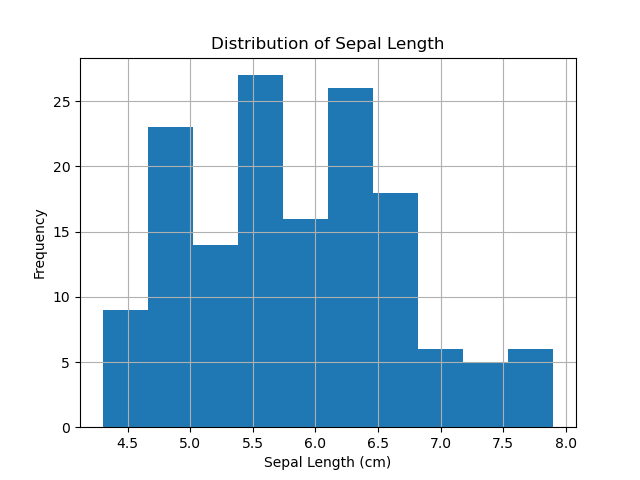
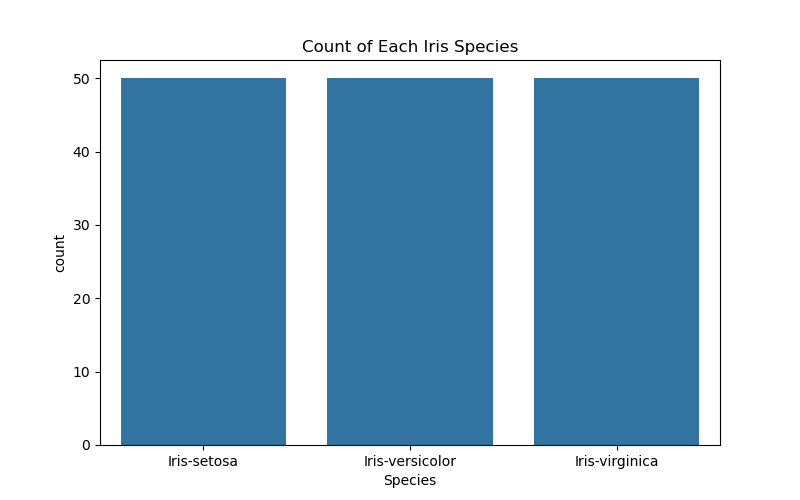
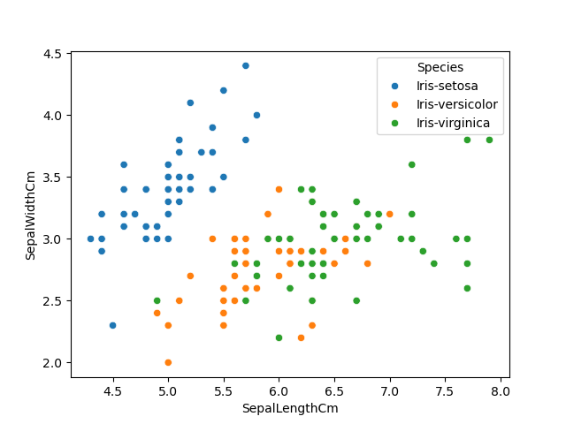

# 🌸 Iris Flower Dataset Analysis

This project explores the classic Iris dataset to understand how petal and sepal measurements vary across the three flower species.

### 📊 What I Did:
- Loaded and inspected the Iris dataset using Pandas
- Performed filtering, sorting, and statistical summaries
- Explored species distribution and feature relationships
- Visualized the data using histograms, boxplots, and scatterplots

### 📈 Visualizations:
- Species count using bar plot
- Boxplot of Petal Length per species
- Scatter plot of Sepal Length vs Sepal Width with species hue

### 🛠️ Tools Used:
- Python
- Pandas
- Matplotlib
- Seaborn

### 📁 Dataset:
Iris dataset from [Kaggle](https://www.kaggle.com/datasets/uciml/iris)

### 💡 Key Insights:
- *Setosa* flowers are clearly separable based on petal length
- Sepal width and length show weak correlation overall
- Petal dimensions are highly effective for species classification

### 📊 Distribution of Sepal Length

### 🧭 Count Species

### ⏱ Species Length

---

## ✅ How to Run
Simply open `iris_analysis.ipynb` in Jupyter Notebook or Google Colab and run the cells.

