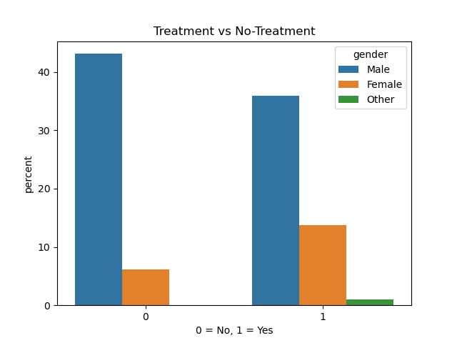
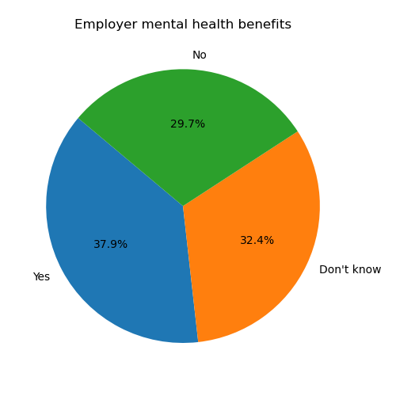
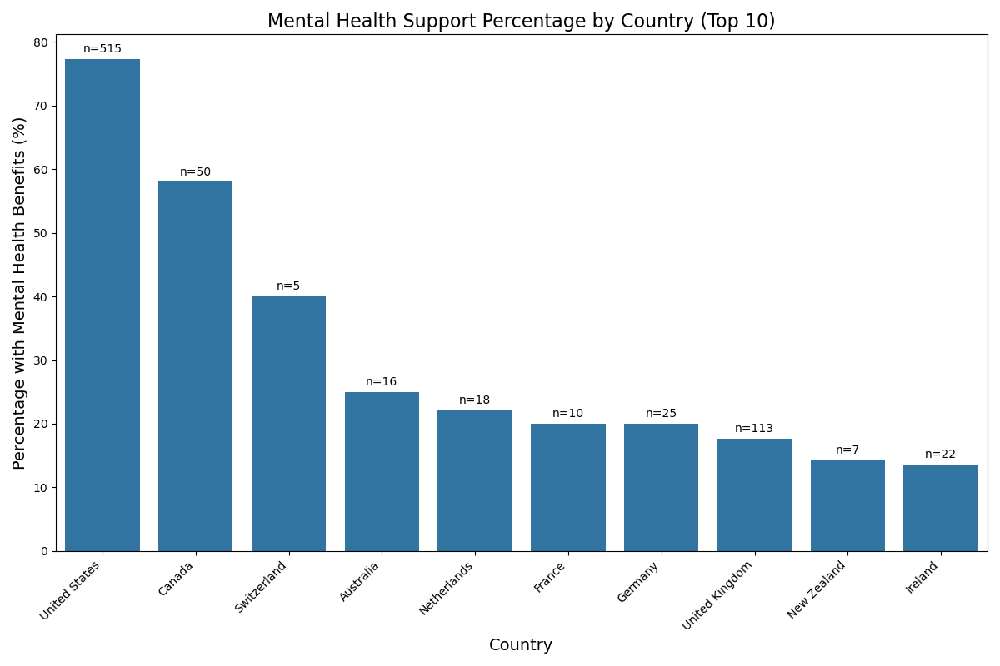

# 🧠 Mental Health in Tech Analysis

This project analyzes survey responses from tech workers to explore mental health patterns, workplace support, and treatment-seeking behavior.

---

### 📊 What I Did:
- Cleaned and standardized messy text/categorical data (gender, age, etc.)
- Removed outliers (e.g. age <16 or >100)
- Grouped by treatment status, gender, and age brackets
- Analyzed employer support like mental health benefits & wellness programs
- Visualized key trends using countplots, bar charts, and pie charts

---

### 📈 Visualizations:
- Countplot: Treatment vs No Treatment
- Pie chart: Mental health benefits availability
- Barplot: Country-wise mental health support awareness
- Heatmap: Mental health workplace factor correlation

---

### 🛠️ Tools Used:
- Python
- Pandas
- Matplotlib
- Seaborn

---

### 📁 Dataset:
[Mental Health in Tech Industry – OSMI](https://www.kaggle.com/datasets/osmi/mental-health-in-tech-survey)

---

### 💡 Key Insights:
- Many tech workers feel unsupported by their companies
- Women are more likely to seek treatment than men
- Employees who know about support options are more likely to get help

---

### 🩺 Treatment vs No Treatment

### 👷 Employee Health Benefits

### 👷 Mental Health Support by Countries

---

### ✅ How to Run
Open `mental_health.ipynb` in Jupyter Notebook or Google Colab and run all cells to explore the data.

