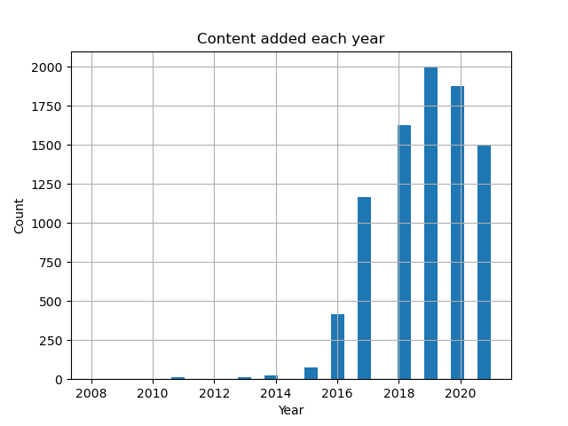

# 📺 Netflix Movies Data Analysis

This project explores and visualizes a dataset of Netflix shows and movies to identify trends in genres, ratings, and production countries.

### 📊 What I Did:
- Cleaned and preprocessed column names
- Performed filtering, selection, and grouping
- Analyzed content type distribution (Movies vs TV Shows)
- Visualized release year trends and most popular genres

### 🛠️ Tools Used:
- Python
- Pandas
- Matplotlib
- Seaborn

### 📁 Dataset:
Netflix Movies & TV Shows dataset from Kaggle

### 🎥 Content added each year

