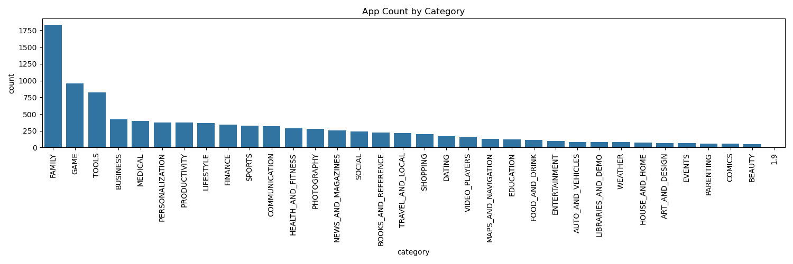
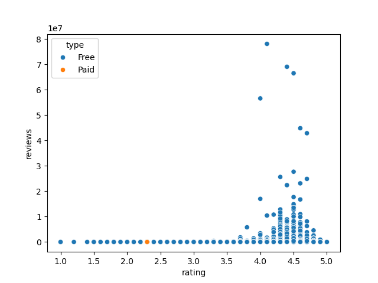
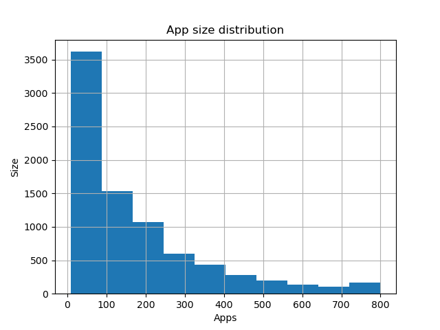
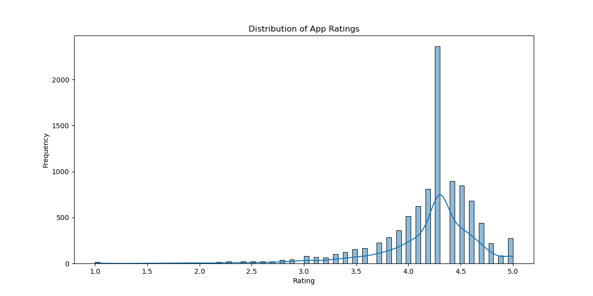

# 📱 Google Play Store App Analysis

This project explores app data from the Google Play Store to find trends in installs, ratings, revenue, and app types.

---

### 📊 What I Did:
- Cleaned dirty values in `installs`, `price`, `size`, and `rating` fields
- Converted strings with symbols (e.g. "1,000,000+", "$4.99") to numeric
- Removed duplicate apps and fixed invalid rows
- Created new features: revenue estimate and app size in MB
- Grouped by app type (Free vs Paid) to compare engagement and performance

---

### 📈 Visualizations:
- Countplot: App count by category
- Boxplot: Ratings for Free vs Paid apps
- Histogram: App size distribution
- Scatterplot: Rating vs Reviews (by app type)

---

### 🛠️ Tools Used:
- Python
- Pandas
- Matplotlib
- Seaborn

---

### 📁 Dataset:
[Google Play Store Apps Dataset](https://www.kaggle.com/datasets/lava18/google-play-store-apps)

---

### 💡 Key Insights:
- Free apps dominate the store and get more installs
- Paid apps have slightly better ratings
- Some categories (like Communication, Social) generate massive installs
- Estimated revenue can vary widely across app types

---

### 🧑‍💻 Apps by category

### ⭐️ Rating vs Reviews by Type

### 🏋️ App Size Distribution

### 🏋️ Hist Plot

---

### ✅ How to Run
Open `playstore_analysis.ipynb` in Jupyter Notebook or Google Colab and run all cells to explore the data.

