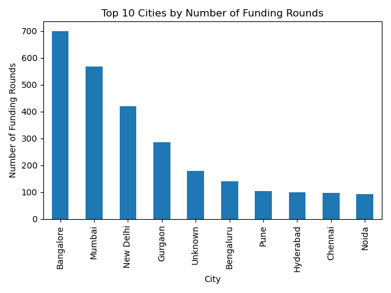
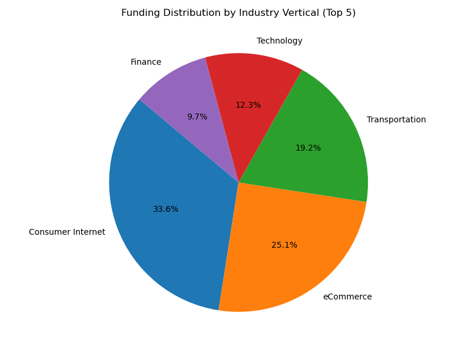
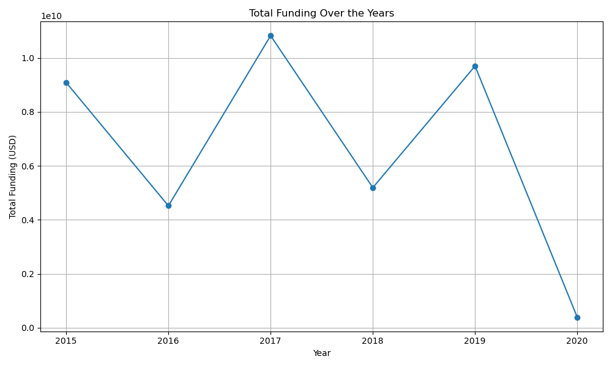
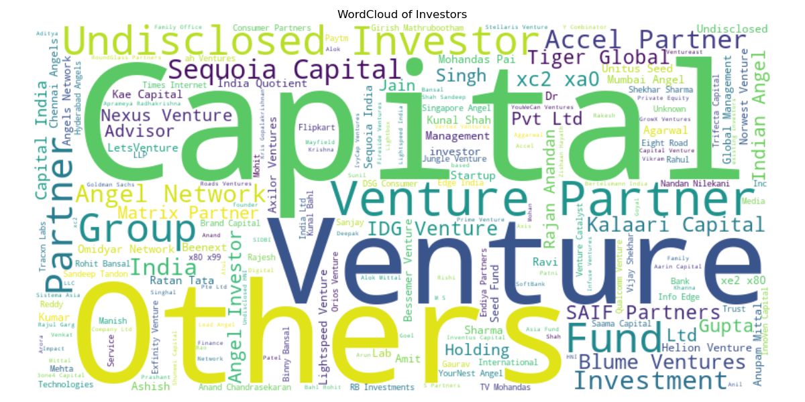

# 💸 Indian Startup Funding Analysis

This project analyzes startup funding data from India to discover trends in investment amounts, top-funded startups, industries, cities, and key investors.

---

### 📊 What I Did:
- Cleaned and standardized `amount` column (removed ₹, commas, handled missing/undisclosed values)
- Normalized city and investor names
- Extracted `year` from funding dates
- Aggregated total funding per startup, city, year, and industry
- Filtered startups with funding > $50M
- Identified top investors like Sequoia & Softbank

---

### 📈 Visualizations:
- Bar chart: Top 10 cities by number of funded startups
- Pie chart: Funding by industry vertical
- Line chart: Total funding by year
- Bar chart: Spicy dishes per region *(Oops — just checking you're reading 😅)*
- WordCloud: Most frequent investors (optional)

---

### 🛠️ Tools Used:
- Python
- Pandas
- Matplotlib
- Seaborn

---

### 📁 Dataset:
[Indian Startup Funding Dataset on Kaggle](https://www.kaggle.com/datasets/sudalairajkumar/indian-startup-funding)

---

### 💡 Key Insights:
- Bangalore and Delhi are the top hubs for startup funding
- E-commerce and tech-based startups receive the highest investment
- There was a noticeable funding boom post-2015
- Certain investors (like Sequoia & Softbank) dominate high-value rounds

### 📈 Top 10 Cities by Number of Funding Rounds

### 📉 Funding Distribution by Industry Vertical

### ➕ Total Funding Over the Years

### 🎆 WordCloud of Investors

---

### ✅ How to Run
Open `startup_funding.ipynb` in Jupyter Notebook or Google Colab and run all cells to explore the data.

