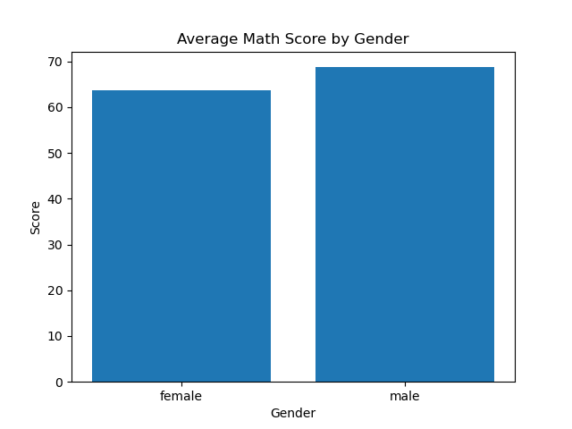
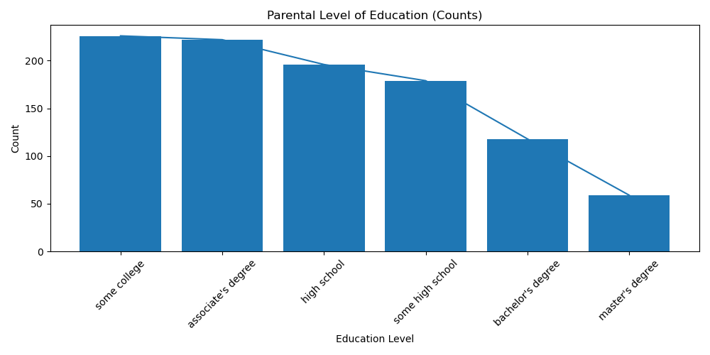
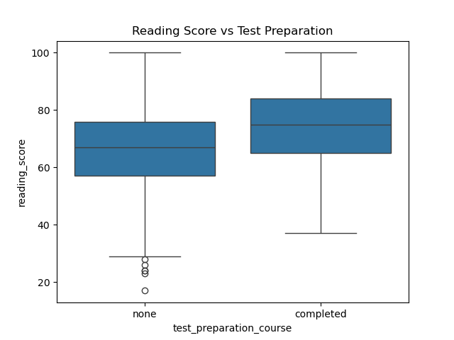

# 🎓 Student Performance Analysis

This project analyzes students’ exam performance based on gender, parental education, and test preparation. The goal is to uncover patterns that affect scores in math, reading, and writing.

---

### 📊 What I Did:
- Cleaned column names for consistency
- Performed exploratory data analysis (EDA)
- Grouped by gender and test prep to compare average scores
- Filtered and counted by demographics
- Created visualizations to show score distributions

---

### 📈 Visualizations:
- Histogram of Math Scores
- Boxplot: Reading Score vs Test Preparation Course
- Bar chart: Parental Education Level distribution

---

### 🛠️ Tools Used:
- Python
- Pandas
- Matplotlib
- Seaborn

---

### 📁 Dataset:
Student Performance dataset from [Kaggle](https://www.kaggle.com/datasets/spscientist/students-performance-in-exams)

---

### 💡 Key Insights:
- Students who completed test preparation scored significantly higher in reading
- Female students had slightly better performance in reading and writing
- Parental education level appears to influence student outcomes

### 📊 Avg Math Score by Gender

###  📚Parental Level Education

### 🆚 Reading Score vs Test Preparation

---

### ✅ How to Run
Open `student_performance_analysis.ipynb` in Jupyter Notebook or Colab, run all cells, and explore the visuals and insights.

