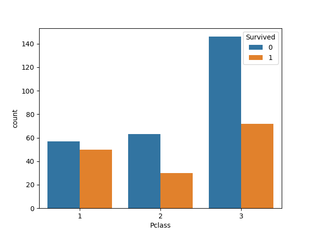
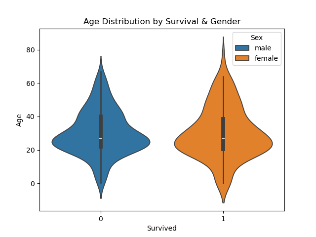
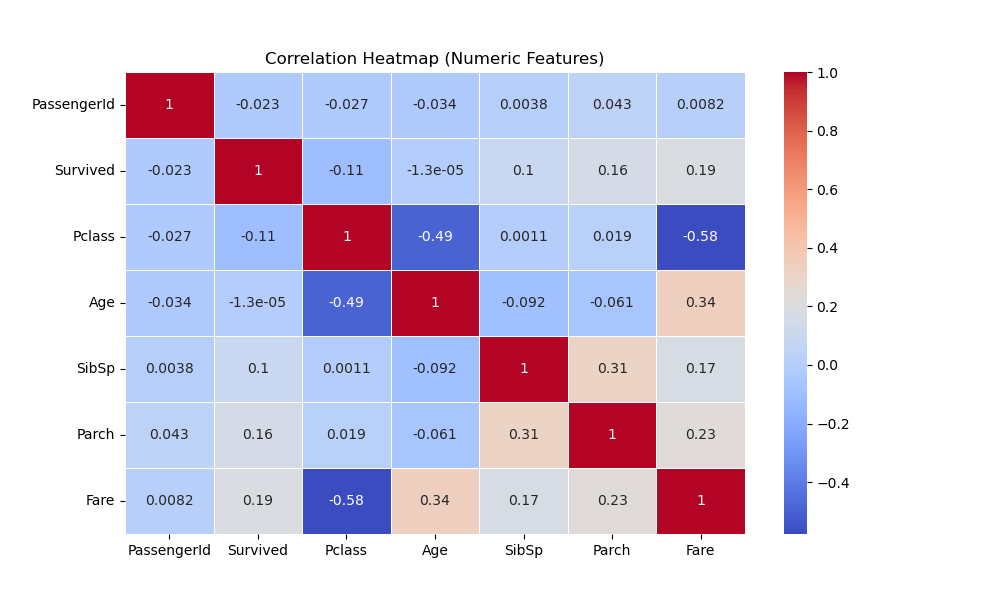

# 🚢 Titanic Survival Analysis

This project analyzes passenger data from the Titanic to explore what factors influenced survival rates, such as gender, age, and passenger class.

---

### 📊 What I Did:
- Cleaned and explored the dataset using Pandas
- Filtered data based on survival, gender, and class
- Calculated average ages for survivors vs non-survivors
- Identified which groups had higher chances of survival
- Counted passengers per gender and class

---

### 📈 Visualizations:
- Bar chart of total survivors vs non-survivors
- Histogram of age distribution
- Boxplot comparing age distributions by survival status
- Countplot of survival by gender

---

### 🛠️ Tools Used:
- Python
- Pandas
- Seaborn
- Matplotlib

---

### 📁 Dataset:
Titanic dataset from [Kaggle](https://www.kaggle.com/competitions/titanic)

---

### 💡 Key Insights:
- Females had a much higher survival rate than males
- Passengers in 1st class had better survival chances
- Average age of survivors was slightly lower than non-survivors
- Children and women were more likely to survive

### 🛥 Survival Vs Non-Survival in PClass

### Age Distribution by Survival and Gender

### Correlation of numeric features

---

### ✅ How to Run
Open `titanic_analysis.ipynb` in Jupyter Notebook or Google Colab and run all cells to see the analysis and visualizations.

